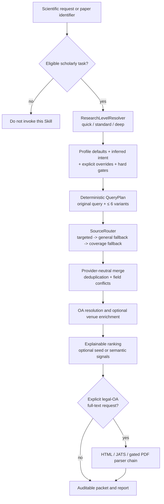

> Component manual. The collection's docs/maintenance.md supersedes the old standalone publish/validate scripts.

# Research Lookup Enhanced

<p align="center">
  <a href="README.md">English</a> |
  <a href="README.zh-CN.md">简体中文</a>
</p>

<p align="center">
  <a href="QUICKSTART.md">User quickstart</a> |
  <a href="QUICKSTART.zh-CN.md">中文快速上手</a> |
  <a href="docs/architecture.md">Architecture</a>
</p>

<!-- Keep this file synchronized with README.zh-CN.md. -->

> Contributor-oriented technical reference for a local Codex Skill that performs
> bounded, multi-source scholarly retrieval and emits auditable evidence packets.

This README describes the implementation, contracts, and contribution workflow.
If you want to use the Skill rather than study or change it, start with the
copy-ready prompts in [QUICKSTART.md](QUICKSTART.md).

## Project status

| Property | Current value |
|---|---|
| Project version | `0.3.0` |
| Runtime | Python `>=3.11` |
| Editable Skill source | `skills/research-lookup-enhanced/` |
| Published workspace artifact | `<workspace>/.agents/skills/research-lookup-enhanced/` |
| Default research profile | `standard` |
| Query planner | Local and deterministic; optional caller-supplied English query, no planner LLM or translation API |
| Automated checks | Standard-library `unittest` suite, offline smoke tests, Skill validation, publication diff |

The repository is the maintainable source project. The package under
`skills/research-lookup-enhanced/` is the only editable Skill source; the workspace
Skill directory is generated by the publication script and must not be edited by
hand.

## Scope and non-goals

Research Lookup Enhanced accepts an already-valid scientific topic, research
question, paper search, or DOI/PMID/PMCID/arXiv lookup. It turns that request into a
deterministic query plan, routes bounded requests across scholarly providers,
reconciles records without discarding disagreements, ranks results explainably, and
optionally creates an evidence packet from legally available open-access content.

The Skill is deliberately **not**:

- a general web, news, shopping, product, or source-code search engine;
- a recursive crawler or an exhaustive systematic-review screening platform;
- an automatic scientific-consensus, causality, or contradiction judge;
- a license bypass or a mechanism for treating inaccessible content as full text;
- an implicit authorization to upload PDFs, download models, or select citation
  seeds;
- a graph-rendering or vector-clustering package. It retrieves citation/reference
  records and can supply a SPECTER2 ranking signal, but those are separate concerns.

Use a dedicated systematic-review workflow when PRISMA screening, exclusion logs,
or formal risk-of-bias assessment is required.

## Architecture



The Agent and runtime have different responsibilities:

- The **Agent** decides whether the Skill applies, interprets natural-language
  constraints, distinguishes explicit user intent from Agent inference, and passes
  structured options.
- The **runtime** applies versioned profiles, clamps budgets, enforces safety gates,
  executes provider calls, and records planned versus actual behavior.

The resolver is not a general request classifier. It runs only after the outer
Skill applicability decision has established that the request is scholarly.

### Core invariants

1. Preserve the exact original query even when normalization or bilingual expansion
   adds provider-specific variants.
2. Build no more than six deterministic query variants and execute no more than
   three finite routing stages.
3. Resolve a fresh immutable effective configuration for every batch query; never
   mutate shared Pipeline policy between queries.
4. Isolate provider, query, enrichment, and parser failures so a partial failure
   does not invalidate the whole batch.
5. Keep provider-native metrics and conflicts separate. Never collapse citation
   counts or relevance scores from different providers into a fictitious raw value.
6. Make full-text extraction, remote PDF upload, model download, and graph seeds
   independent explicit decisions.
7. Record both selection-time configuration and runtime outcomes in the search
   ledger.

## Research profiles

Profiles are versioned defaults, not independent search engines. Explicit CLI or
Python values override profile fields; hard limits and safety gates still win.

| Profile | Intended use | Routed request budget | Key behavior |
|---|---|---:|---|
| `quick` | Known papers and a small core set | 6 | Three variants; no Easy Scholar by default |
| `standard` | Ordinary scientific questions | 12 | Backward-compatible default; up to six variants |
| `deep` | Broader coverage and more fallback | 24 | Larger record/graph/full-text limits, but no implicit full text |

Omitting `--research-level` selects `standard`. `auto` is an explicit standalone-CLI
mode with conservative rules; it is not the default. No profile enables full text,
MinerU, model download, or citation expansion by itself.

The full profile table, per-provider budgets, precedence rules, auto signals, reason
codes, and safety boundaries are defined in
[research-levels.md](skills/research-lookup-enhanced/references/research-levels.md).

## Repository layout

```text
research-lookup_enhanced/
├── README.md / README.zh-CN.md       contributor-facing technical reference
├── QUICKSTART.md / QUICKSTART.zh-CN.md
│                                      user-facing, copy-ready tutorial
├── docs/architecture.md               architecture diagrams and boundaries
├── pyproject.toml                     Python version and optional dependencies
├── scripts/
│   ├── validate.ps1                   aggregate local validation
│   ├── offline_smoke.py               deterministic integration smoke checks
│   └── publish.ps1                    source -> workspace Skill publication
├── tests/
│   ├── test_query_expansion.py        bilingual planning and ranking tests
│   └── test_research_levels.py        profile, CLI, isolation, and ledger tests
└── skills/research-lookup-enhanced/      only editable Skill package
    ├── SKILL.md                       Agent instructions and trigger boundary
    ├── agents/openai.yaml             UI metadata and default prompt
    ├── references/                    on-demand technical contracts
    └── scripts/
        ├── research_lookup.py         primary CLI and ResearchLookup facade
        ├── manuscript_packet.py       packet assembly compatibility layer
        ├── extract_url.py             bounded extraction helper
        └── rle/                       provider-neutral runtime
```

### Runtime module map

| Module | Responsibility |
|---|---|
| `research_profile.py` | Immutable profiles, level decision, auto signals, override merging, hard clamps |
| `query_plan.py` | Original-query preservation, identifiers, filters, concepts, variants, deterministic plan |
| `source_router.py` | Capability routing, three-stage fallback, global/provider request budget |
| `providers.py` | OpenAlex, Semantic Scholar, Crossref, Europe PMC, Unpaywall, and Easy Scholar adapters |
| `http_client.py` | Cache keys, pacing, bounded retries, redaction, request provenance |
| `models.py` | Provider-neutral paper, evidence, filter, and provenance records |
| `ranking.py` | Explainable deterministic ranker and lazy optional SPECTER2 backend |
| `extraction.py` | OA acquisition, HTML/JATS extraction, gated PDF parser chain |
| `pipeline.py` | Per-query orchestration, graph/recommendation expansion, enrichment, packet emission |
| `reporting.py` | Deterministic research report and machine-readable report inputs |
| `evidence_provider.py` | Optional external evidence handoff protocol without a hard dependency |
## Provider contracts

| Provider | Runtime role | Configuration | Important boundary |
|---|---|---|---|
| OpenAlex | Broad discovery, identifiers, hosted semantic search, citations/references | `OPENALEX_API_KEY` | Key-gated by this project |
| Crossref | DOI and publisher-deposited bibliographic metadata | No key; `CROSSREF_MAILTO` recommended | Not a semantic oracle |
| Europe PMC | Biomedical discovery, PMID/PMCID, citations/references, public JATS | No key | Paced at one request/second by default |
| Semantic Scholar | Search, details/batch, citations/references, seed recommendations | `SEMANTIC_SCHOLAR_API_KEY` | Process-wide serialization; starts at least 1.2 seconds apart |
| Unpaywall | Post-merge DOI-to-legal-OA resolution | `UNPAYWALL_EMAIL` | Never a discovery source |
| Easy Scholar | Post-merge unique-venue metrics | `EASYSCHOLAR_SECRET_KEY` | Excluded from paper relevance and evidence quality |

`S2_API_KEY` and `EASYSCHOLAR_API_KEY` are legacy aliases used only when their
primary variables are absent. The application reads the process environment; it
does **not** automatically load `.env` files. Provider status exposes only
`configured` or `not configured`; this reports variable presence, not live key
validity, quota, or account entitlement.

Provider endpoints, neutral-filter mappings, retry behavior, cache policy, and the
dependency reuse audit live in
[provider-matrix.md](skills/research-lookup-enhanced/references/provider-matrix.md).

### Routing and graph semantics

The shared routed budget covers discovery, Semantic Scholar recommendations, and
citation/reference expansion. It counts logical provider operations, not raw HTTP
requests; an adapter may need more than one HTTP request to resolve a seed and fetch
an edge page. A failed operation still consumes its routed budget slot.
`--providers` restricts discovery adapters only. Unpaywall and Easy Scholar are
separately gated, bounded post-merge stages.

The citation directions are fixed:

```text
forward citation: later paper -> cites -> seed paper
backward reference: seed paper -> cites -> earlier paper
```

`--citation-seed` currently attempts one bounded `get_citations` pass and one
bounded `get_references` pass for every eligible provider with remaining budget.
The CLI does not have a one-direction-only flag. Results can be separated by their
citation/reference facet at presentation time, but the underlying operation is
single-page and non-recursive—not an exhaustive citation-network crawl. The result
envelope's top-level `citations` field is a bibliography-oriented DOI/source list,
not “forward citations”; direction comes from record facets and the
`get_citations`/`get_references` ledger operations.

Positive/negative Semantic Scholar seeds are a recommendation operation, not
citation edges. Recommendation order is preserved without inventing a provider
score.

## Records, ranking, and evidence

Deduplication proceeds through stable identifiers first—DOI, PMID/PMCID, provider
IDs, and canonical URL—then normalized title plus lead author. Selected values keep
`field_sources`; disagreements remain in `field_conflicts`. Provider-specific
counts and relevance values remain under `metrics_by_provider`.

The default ranker exposes weighted components rather than one unexplained score:

- required: title, abstract, method, field, and year fit;
- optional: semantic similarity, seed-graph proximity, evidence availability, and
  an age-adjusted provider-separated citation signal.

SPECTER2 is a lazy optional ranking backend. It does not run by default, cluster
papers, or create citation edges. Missing dependencies or model files cause a
recorded fallback unless model download was explicitly allowed.

Verification states distinguish full-text extraction, public-page extraction,
abstract-only evidence, identifier-only records, and search-only results. Metadata
or an abstract must never be described as full-text reviewed. The complete record
and packet contract is in
[output-schema.md](skills/research-lookup-enhanced/references/output-schema.md).

## Full-text and parser safety

Only locations explicitly marked open access can enter extraction. HTML and JATS
remain local. OA PDFs use this ordered chain:

1. MinerU remote wrapper only when the caller explicitly supplies
   `--extract-fulltext --allow-remote-parser`, the location is OA, and
   `MINERU_API_KEY` is configured;
2. lazily imported local MarkItDown when installed;
3. local `pypdf` page text with an explicit low-structure-fidelity warning.

Research level and `auto` intent can never authorize remote upload. Likewise,
`--specter2` cannot download a missing model unless `--allow-model-download` is
also explicitly supplied.

Parser outputs, skips, warnings, and failures remain in `extraction-ledger.json`
and per-document `parser-ledger.json`. The current default MinerU executable and
wrapper paths are workspace-specific and have no CLI override, so that remote
integration is not portable without code or environment adaptation. See
[document-parsers.md](skills/research-lookup-enhanced/references/document-parsers.md).

## Interfaces

The primary executable interface is the source script:

```powershell
.\.venv\Scripts\python.exe `
  .\skills\research-lookup-enhanced\scripts\research_lookup.py --help
```

No console-script entry point is declared in `pyproject.toml`; an editable install
installs runtime dependencies and distribution metadata, but the CLI remains the
explicit script path. Source-based programmatic use must add the Skill's `scripts`
directory to `sys.path`:

```python
from pathlib import Path
import sys

skill_root = Path("skills/research-lookup-enhanced").resolve()
sys.path.insert(0, str(skill_root / "scripts"))

from research_lookup import ResearchLookup

lookup = ResearchLookup(
    providers=["crossref", "europe_pmc"],
    research_level="quick",
)
plan = lookup.plan("DOI:10.1038/s41586-020-2649-2")
result = lookup.lookup(
    "DOI:10.1038/s41586-020-2649-2",
    packet_dir="artifacts/python-api",
)
```

The `ResearchLookup` facade exposes `plan()`, `lookup()`, and `batch_lookup()` for
in-process integration. `ResearchPipeline.build_query_plan()` and `run()` accept an
optional per-query `EffectiveRunConfig`; omitting it retains compatible `standard`
defaults. Treat serialized packet schemas as the stronger integration boundary and
add compatibility tests before depending on internal classes. `lookup()` converts
runtime failures into a `success: false` envelope; invalid constructor/configuration
arguments may still raise. With `--json`, even one query is rendered as a one-element
JSON array.

CLI exit codes are `0` for successful status/plan or all-successful queries, `1` for
missing input or any failed query, and `2` for CLI/configuration errors.

Two CLI modes are offline:

```powershell
# Reads configuration presence only; never prints values.
.\.venv\Scripts\python.exe `
  .\skills\research-lookup-enhanced\scripts\research_lookup.py `
  --show-provider-status

# Resolves level, variants, route, and budgets without provider calls.
.\.venv\Scripts\python.exe `
  .\skills\research-lookup-enhanced\scripts\research_lookup.py `
  "your scientific question" --show-query-plan
```

## Packet artifacts

Supplying `--packet-dir` creates an auditable directory rather than only terminal
output. Start with these artifacts:

| Artifact | Contract |
|---|---|
| `packet.md` / `packet.json` | Complete human/machine packet |
| `references.json` / `references.bib` | Normalized references and BibTeX |
| `evidence-matrix.json` | Excerpts, locators, extraction method, quality, and conflicts |
| `coverage.json` | Target shortfall and source/evidence composition |
| `search-ledger.json` | Level selection, routes, budgets, graph work, errors, and outcome audit |
| `extraction-ledger.json` | OA acquisition and parser attempts |
| `research-report.md` | Deterministic citation-linked report |

Additional claim maps, synthesis candidates, section briefs, provenance, full-text
files, and report inputs are documented in `output-schema.md`. The report organizes
source-derived evidence; it does not infer scientific consensus, causality,
clinical recommendations, or the user's experimental Results.

## Development setup

```powershell
python -m venv .venv
.\.venv\Scripts\Activate.ps1
python -m pip install --upgrade pip
python -m pip install -e .
```

Optional parser extras are isolated:

```powershell
python -m pip install -e ".[html]"
python -m pip install -e ".[markitdown]"
```

The `semantic` extra is intentionally empty. SPECTER2 and its model/framework
surface remain an explicit local decision rather than a default dependency. Use
[.env.example](.env.example) only as a variable-name reference; never put real
credentials in repository files, commands, fixtures, logs, Markdown, or provenance.

## Validation strategy

Portable focused checks from an activated environment are:

```powershell
python .\skills\research-lookup-enhanced\scripts\research_lookup.py --help
python .\skills\research-lookup-enhanced\scripts\research_lookup.py --show-provider-status
python .\skills\research-lookup-enhanced\scripts\research_lookup.py `
  "ordinary scientific question" --show-query-plan
python -m unittest discover -s .\tests -v
python .\scripts\offline_smoke.py
.\scripts\publish.ps1 -WhatIf
```

The aggregate local command is:

```powershell
.\scripts\validate.ps1
.\scripts\validate.ps1 -CheckPublished
```

It runs Skill structural validation, CLI help, provider-status redaction, the
standard-library unit test suite, the offline smoke suite, publication preview,
and—when requested—the source/published hash comparison.

Collection maintenance now uses scripts/skills.py and scripts/validate.py. Commands run from the collection root; host-specific paths are not required.

Automated tests are offline/mocked. Live provider behavior, quotas, and account
entitlements are intentionally outside this validation path.

## Publication workflow

```powershell
# Edit the source package, then validate and preview.
.\scripts\validate.ps1
.\scripts\publish.ps1 -WhatIf

# Publish to the dedicated workspace Skill directory and verify hashes.
.\scripts\publish.ps1
.\scripts\publish.ps1 -Check
```

`publish.ps1` copies changed package files, removes stale/generated files from the
dedicated destination, rejects `__pycache__` and bytecode in the source package,
and compares SHA-256 hashes after publication. `-WhatIf` writes nothing; `-Check`
compares without publishing.

The destination must be a dedicated Skill directory: stale-file cleanup removes
files absent from the source. Publication is not atomic and has no automatic
rollback. It is not a PyPI release and does not create a Git commit, tag, remote
push, or version bump. Repository-level README, Quickstart, tests, environment
examples, and release tooling are intentionally outside the published Skill.

## Contributing

Keep changes narrow and preserve the contracts above. A useful PR should normally:

1. state which layer changes: resolver, QueryPlan, router, provider, model, ranker,
   extraction, reporting, or release tooling;
2. add or update offline tests for behavior, failure handling, and audit output;
3. preserve credential redaction and avoid fixtures containing live secrets;
4. keep pacing, retries, caching, and request-budget accounting in shared paths;
5. document new fields and preserve backward compatibility or provide a migration;
6. update both English and Chinese documentation for visible behavior changes;
7. edit `skills/research-lookup-enhanced/`, never the generated `.agents` copy;
8. validate before publication and finish with `publish.ps1 -Check`.

### Change map

| Change | Required companion work |
|---|---|
| Research profiles/resolver | `research-levels.md`; precedence, ambiguity, negation, isolation, and hard-gate tests |
| Query planning/routing | `query-routing.md`; six-variant and three-stage caps, original-query fallback, budget tests |
| Provider/endpoint | `provider-matrix.md`; auth redaction, neutral mapping, pacing/retry/cache mocks, provenance |
| Ranking/backend | Component reasons, within-backend normalization, retraction exclusion, deterministic fallback |
| Full text/parser | `document-parsers.md`; OA/remote gates, parser provenance, fidelity labels, failure continuation |
| Schema/report | `output-schema.md`; reference IDs, locators, verification labels, deterministic serialization |
| Published package | Source edit, preview, dedicated destination, forbidden-file check, hash equality |

Do not vendor provider SDKs, models, or another Skill's internal files merely because
they are available. New dependencies need a concrete capability gain that justifies
their compatibility, supply-chain, and maintenance cost.

## Known limitations

- Citation and reference expansion is single-page, bounded, and non-recursive.
- Crossref backward references are depositor-supplied and may contain only shallow
  DOI/title/year/venue fragments rather than fully resolved records.
- SPECTER2 is an optional relevance signal, not vector clustering or graph layout.
- The local bilingual lexicon is conservative and is not a general translator.
- `EvidenceProvider`/Sciverse is currently a protocol and serialization boundary;
  no adapter is registered in the main Pipeline.
- Provider coverage, metadata, and indexing latency differ; absence in one source is
  not proof of global absence.
- Easy Scholar enriches venues only and is not evidence of paper quality.
- Local PDF fallbacks cannot guarantee formula, table, or reading-order fidelity.
- The deterministic report cannot replace expert interpretation or formal
  systematic-review methods.
- The repository does not yet include a LICENSE, CONTRIBUTING file, changelog, or CI
  workflow; add those before presenting it as a fully public contribution surface.

## Technical documentation

- [Architecture and data flow](docs/architecture.md)
- [Research profiles and precedence](skills/research-lookup-enhanced/references/research-levels.md)
- [QueryPlan, routing, fallback, and budgets](skills/research-lookup-enhanced/references/query-routing.md)
- [Provider endpoints, configuration, pacing, and reuse audit](skills/research-lookup-enhanced/references/provider-matrix.md)
- [Unified records and packet schema](skills/research-lookup-enhanced/references/output-schema.md)
- [Document parser contract and safety gates](skills/research-lookup-enhanced/references/document-parsers.md)
- [User quickstart and copy-ready prompts](QUICKSTART.md)
