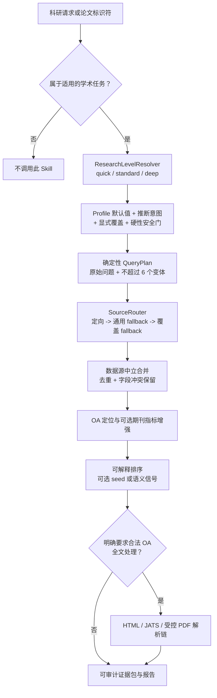

> Component manual. The collection's docs/maintenance.md supersedes the old standalone publish/validate scripts.

# Research Lookup Enhanced

<p align="center">
  <a href="README.md">English</a> |
  <a href="README.zh-CN.md">简体中文</a>
</p>

<p align="center">
  <a href="QUICKSTART.md">User quickstart</a> |
  <a href="QUICKSTART.zh-CN.md">中文快速上手</a> |
  <a href="docs/architecture.md">架构</a>
</p>

<!-- 请与 README.md 同步维护。 -->

> 面向贡献者的技术参考：一个执行有界、多数据源学术检索，并输出可审计证据包的本地 Codex Skill。

本文介绍实现结构、接口契约与贡献流程。如果你是想直接使用 Skill，而不是研究或修改它，请从包含可复制提示词的 [QUICKSTART.zh-CN.md](QUICKSTART.zh-CN.md) 开始。

## 项目状态

| 项目 | 当前值 |
|---|---|
| 项目版本 | `0.3.0` |
| 运行环境 | Python `>=3.11` |
| 唯一可编辑 Skill 源码 | `skills/research-lookup-enhanced/` |
| 工作区发布产物 | `<workspace>/.agents/skills/research-lookup-enhanced/` |
| 默认调研 Profile | `standard` |
| 查询规划器 | 本地、确定性；可接收调用方英文查询，不由规划器调用 LLM 或翻译 API |
| 自动检查 | 标准库 `unittest` 套件、离线 smoke、Skill 校验、发布差异检查 |

本仓库是可维护源码项目。`skills/research-lookup-enhanced/` 下的包是唯一正式 Skill 源码；工作区 Skill 目录由发布脚本生成，不应手工修改。

## 范围与非目标

Research Lookup Enhanced 接受一个已经确认属于科研领域的主题、研究问题、论文检索，或 DOI/PMID/PMCID/arXiv 标识符查询。它会构建确定性检索计划，在有界预算内路由多个学术数据源，在不丢弃分歧的前提下合并记录，执行可解释排序，并可选地从合法开放获取内容生成证据包。

本 Skill 明确**不是**：

- 通用网页、新闻、购物、商品或源代码搜索器；
- 递归爬虫或完整的系统综述筛选平台；
- 自动判定科学共识、因果关系或矛盾证据的系统；
- 绕过许可限制，或把无法访问内容称为“已阅读全文”的工具；
- 上传 PDF、下载模型或自动选择引用 seed 的隐式授权；
- 图谱渲染或向量聚类包。它可以获取引用/参考文献记录，也能提供 SPECTER2 排序信号，但这是不同层面的能力。

需要 PRISMA 筛选、排除日志或正式偏倚风险评估时，应使用专门的系统综述工作流。

## 架构



Agent 和运行时代码承担不同职责：

- **Agent** 判断 Skill 是否适用，理解自然语言约束，区分用户明确意图与 Agent 推断，并传入结构化选项。
- **运行时** 应用版本化 Profile、限制预算、执行安全门、调用数据源，并分别记录计划配置与实际行为。

Resolver 不是通用请求分类器。只有外层已经确认请求属于科研检索后，它才负责决定检索深度。

### 核心不变量

1. 即使规范化或双语扩展增加了数据源专用变体，也始终保留完整原始问题。
2. 最多构建六个确定性查询变体，最多执行三个有限路由阶段。
3. batch 中每条查询都生成新的不可变有效配置，不把单条查询的策略写回共享 Pipeline。
4. 隔离数据源、查询、增强和解析器错误，局部失败不能终止整个 batch。
5. 分开保留数据源原生指标和字段冲突，不把不同来源的引用量或相关性分数压成虚构的原始值。
6. 全文抽取、远程 PDF 上传、模型下载和引用 seed 必须是彼此独立的明确决策。
7. 在 search ledger 中同时记录等级选择配置和运行结果。

## 调研 Profile

Profile 是版本化默认值，不是三套独立搜索引擎。显式 CLI 或 Python 参数覆盖 Profile 字段，但硬上限和安全门仍具有最终优先级。

| Profile | 适用场景 | 路由请求预算 | 关键行为 |
|---|---|---:|---|
| `quick` | 已知论文和少量核心文献 | 6 | 三个查询变体；默认关闭 Easy Scholar |
| `standard` | 普通科研问题 | 12 | 向后兼容默认值；最多六个变体 |
| `deep` | 更广覆盖和更多 fallback | 24 | 更大的记录、图和全文候选上限，但不隐式开启全文 |

省略 `--research-level` 时选择 `standard`。`auto` 是独立 CLI 的显式、保守规则模式，不是默认值。任何 Profile 都不会自行开启全文、MinerU、模型下载或引用扩展。

完整 Profile 表、各数据源子预算、优先级、auto 信号、reason code 和安全边界位于 [research-levels.md](skills/research-lookup-enhanced/references/research-levels.md)。

## 仓库结构

```text
research-lookup_enhanced/
├── README.md / README.zh-CN.md       面向贡献者的技术参考
├── QUICKSTART.md / QUICKSTART.zh-CN.md
│                                      面向用户的可复制教程
├── docs/architecture.md               架构图与边界
├── pyproject.toml                     Python 版本和可选依赖
├── scripts/
│   ├── validate.ps1                   聚合本地验证
│   ├── offline_smoke.py               确定性集成 smoke
│   └── publish.ps1                    源码 -> 工作区 Skill 发布
├── tests/
│   ├── test_query_expansion.py        双语规划与排序测试
│   └── test_research_levels.py        Profile、CLI、隔离与 ledger 测试
└── skills/research-lookup-enhanced/      唯一可编辑 Skill 包
    ├── SKILL.md                       Agent 指令与触发边界
    ├── agents/openai.yaml             UI 元数据与默认提示词
    ├── references/                    按需加载的技术契约
    └── scripts/
        ├── research_lookup.py         主 CLI 与 ResearchLookup facade
        ├── manuscript_packet.py       packet 组装兼容层
        ├── extract_url.py             有界抽取辅助程序
        └── rle/                       数据源中立运行时
```

### 运行时模块图

| 模块 | 职责 |
|---|---|
| `research_profile.py` | 不可变 Profile、等级决策、auto 信号、覆盖合并与硬限制 |
| `query_plan.py` | 原始问题保留、标识符、过滤条件、概念、变体与确定性计划 |
| `source_router.py` | 能力路由、三阶段 fallback、全局/数据源请求预算 |
| `providers.py` | OpenAlex、Semantic Scholar、Crossref、Europe PMC、Unpaywall、Easy Scholar 适配器 |
| `http_client.py` | 缓存键、限速、有界重试、脱敏和请求 provenance |
| `models.py` | 数据源中立的论文、证据、过滤和 provenance 记录 |
| `ranking.py` | 可解释确定性排序与惰性可选 SPECTER2 后端 |
| `extraction.py` | OA 获取、HTML/JATS 抽取与受控 PDF 解析链 |
| `pipeline.py` | 逐查询编排、图/推荐扩展、增强和 packet 输出 |
| `reporting.py` | 确定性研究报告与机器可读报告输入 |
| `evidence_provider.py` | 无硬依赖的可选外部证据交接协议 |
## 数据源契约

| 数据源 | 运行时角色 | 配置 | 重要边界 |
|---|---|---|---|
| OpenAlex | 广泛发现、标识符、托管语义检索、引用/参考文献 | `OPENALEX_API_KEY` | 本项目要求 Key |
| Crossref | DOI 与出版商提交的书目信息 | 无需 Key；建议 `CROSSREF_MAILTO` | 不是语义检索器 |
| Europe PMC | 生物医学发现、PMID/PMCID、引用/参考文献、公开 JATS | 无需 Key | 默认每秒一次请求 |
| Semantic Scholar | 搜索、详情/batch、引用/参考文献、seed 推荐 | `SEMANTIC_SCHOLAR_API_KEY` | 进程内串行；请求起点至少间隔 1.2 秒 |
| Unpaywall | 合并后的 DOI -> 合法 OA 地址解析 | `UNPAYWALL_EMAIL` | 从不参与论文发现 |
| Easy Scholar | 合并后按唯一 venue 增强指标 | `EASYSCHOLAR_SECRET_KEY` | 不进入论文相关性和证据质量 |

只有主变量不存在时才使用 `S2_API_KEY` 和 `EASYSCHOLAR_API_KEY` 兼容别名。程序读取进程环境，**不会**自动加载 `.env` 文件。Provider status 只能显示 `configured` 或 `not configured`；这只表示变量存在，不代表 key、配额或账户权限已通过实时验证。

端点、通用过滤映射、重试、缓存和依赖复用审计位于 [provider-matrix.md](skills/research-lookup-enhanced/references/provider-matrix.md)。

### 路由与引用图语义

发现、Semantic Scholar 推荐和引用/参考文献扩展共享路由预算。预算统计逻辑 provider operation，而不是原始 HTTP 请求数；adapter 可能需要先解析 seed，再请求一页关系数据。失败的 operation 也会消耗预算槽位。`--providers` 只限制 discovery adapter；Unpaywall 与 Easy Scholar 分别由独立开关控制，属于有界的合并后阶段。

引用方向固定如下：

```text
前向引用：后来的论文 -> 引用了 -> seed 论文
后向参考文献：seed 论文 -> 引用了 -> 更早的论文
```

`--citation-seed` 当前会在仍有预算且支持相应能力的数据源上，各尝试一次有界的 `get_citations` 和 `get_references`。CLI 没有“只查一个方向”的独立参数；呈现时可以依据 citation/reference facet 分组，但底层操作是单页、非递归获取，不是穷尽式引文网络爬取。结果 envelope 顶层的 `citations` 字段是便于生成 bibliography 的 DOI/source 列表，不表示“前向引用”；方向应读取记录 facet 以及 ledger 中的 `get_citations`/`get_references` operation。

Semantic Scholar 的 positive/negative seed 是相似论文推荐，不是引用边。系统保留推荐顺序，但不会虚构数据源原生数值分数。

## 记录、排序与证据

去重首先使用 DOI、PMID/PMCID、数据源 ID 和 canonical URL 等稳定标识符，随后才使用规范化标题加第一作者。选定字段保留 `field_sources`，不同值保留在 `field_conflicts`，数据源专有指标保留在 `metrics_by_provider`。

默认排序器公开各个加权组成项，而不是只给一个无法解释的分数：

- 必需项：标题、摘要、方法、领域和年份匹配；
- 可选项：语义相似度、seed 图邻近度、证据可用性和按数据源分离且考虑论文年龄的引用信号。

SPECTER2 是惰性可选排序后端。它默认不运行，也不负责论文聚类或创建引用边。缺少依赖或模型时会记录错误并回退；只有明确允许时才能下载模型。

验证状态区分全文抽取、公开网页抽取、仅摘要、仅标识符和仅检索结果。元数据或摘要不能描述成“已阅读全文”。完整记录和 packet 契约见 [output-schema.md](skills/research-lookup-enhanced/references/output-schema.md)。

## 全文与解析器安全

只有明确标记为开放获取的位置才可进入抽取流程。HTML 和 JATS 在本地处理。OA PDF 使用以下顺序：

1. 只有调用方明确提供 `--extract-fulltext --allow-remote-parser`、地址属于 OA 且已配置 `MINERU_API_KEY` 时，才运行 MinerU 远程 wrapper；
2. 已安装时惰性导入本地 MarkItDown；
3. 使用本地 `pypdf` 页面文本，并明确标注低结构保真警告。

调研等级和 `auto` 意图永远不能授权远程上传。同样，`--specter2` 只有同时明确传入 `--allow-model-download` 才能下载缺失模型。

解析器输出、跳过、警告和失败会保留在 `extraction-ledger.json` 与逐文档 `parser-ledger.json`。当前 MinerU executable 与 wrapper 默认路径是工作区专用路径，CLI 没有覆盖参数，因此远程集成在其他机器上需要调整代码或环境。详见 [document-parsers.md](skills/research-lookup-enhanced/references/document-parsers.md)。

## 接口

主要可执行接口是源码脚本：

```powershell
.\.venv\Scripts\python.exe `
  .\skills\research-lookup-enhanced\scripts\research_lookup.py --help
```

`pyproject.toml` 没有声明 console-script entry point；editable install 会安装运行依赖和 distribution metadata，但 CLI 仍需使用明确的脚本路径。源码方式的 Python 集成必须把 Skill 的 `scripts` 目录加入 `sys.path`：

```python
from pathlib import Path
import sys

skill_root = Path("skills/research-lookup-enhanced").resolve()
sys.path.insert(0, str(skill_root / "scripts"))

from research_lookup import ResearchLookup

lookup = ResearchLookup(
    providers=["crossref", "europe_pmc"],
    research_level="quick",
)
plan = lookup.plan("DOI:10.1038/s41586-020-2649-2")
result = lookup.lookup(
    "DOI:10.1038/s41586-020-2649-2",
    packet_dir="artifacts/python-api",
)
```

`ResearchLookup` facade 提供 `plan()`、`lookup()` 和 `batch_lookup()` 供进程内集成。`ResearchPipeline.build_query_plan()` 与 `run()` 接受可选的逐查询 `EffectiveRunConfig`；省略时保留兼容的 `standard` 默认值。序列化 packet schema 是更稳定的集成边界，依赖内部类前应补兼容性测试。`lookup()` 会把运行期失败转换成 `success: false` envelope；无效 constructor/configuration 参数仍可能抛出异常。即使只有一条查询，`--json` 也输出单元素 JSON 数组。

CLI 退出码：status/plan 成功或全部查询成功时为 `0`；缺少输入或任一查询失败时为 `1`；CLI/configuration 错误为 `2`。

以下两个 CLI 模式完全离线：

```powershell
# 只读取配置是否存在，永远不打印值。
.\.venv\Scripts\python.exe `
  .\skills\research-lookup-enhanced\scripts\research_lookup.py `
  --show-provider-status

# 解析等级、变体、路由和预算，不调用数据源。
.\.venv\Scripts\python.exe `
  .\skills\research-lookup-enhanced\scripts\research_lookup.py `
  "你的科研问题" --show-query-plan
```

## 证据包产物

传入 `--packet-dir` 后会生成可审计目录，而不仅是终端输出。首先查看以下文件：

| 产物 | 契约 |
|---|---|
| `packet.md` / `packet.json` | 完整的人类/机器可读 packet |
| `references.json` / `references.bib` | 规范化参考文献和 BibTeX |
| `evidence-matrix.json` | 摘录、定位符、抽取方法、质量和冲突 |
| `coverage.json` | 目标缺口与数据源/证据构成 |
| `search-ledger.json` | 等级选择、路由、预算、图操作、错误和结果审计 |
| `extraction-ledger.json` | OA 获取与解析器尝试 |
| `research-report.md` | 带引用关联的确定性报告 |

其他 claim map、synthesis candidate、section brief、provenance、全文文件和报告输入在 `output-schema.md` 中定义。报告只组织来源证据，不推断科学共识、因果关系、临床建议或用户自己的实验 Results。

## 开发环境

```powershell
python -m venv .venv
.\.venv\Scripts\Activate.ps1
python -m pip install --upgrade pip
python -m pip install -e .
```

按需安装解析器 extras：

```powershell
python -m pip install -e ".[html]"
python -m pip install -e ".[markitdown]"
```

`semantic` extra 当前故意为空。SPECTER2 及其模型/框架依赖是显式本地决策，不属于默认依赖。仅把 [.env.example](.env.example) 当作变量名参考；不得把真实凭据写入仓库文件、命令、fixture、日志、Markdown 或 provenance。

## 验证策略

激活虚拟环境后，可移植的独立检查是：

```powershell
python .\skills\research-lookup-enhanced\scripts\research_lookup.py --help
python .\skills\research-lookup-enhanced\scripts\research_lookup.py --show-provider-status
python .\skills\research-lookup-enhanced\scripts\research_lookup.py `
  "ordinary scientific question" --show-query-plan
python -m unittest discover -s .\tests -v
python .\scripts\offline_smoke.py
.\scripts\publish.ps1 -WhatIf
```

聚合本地命令是：

```powershell
.\scripts\validate.ps1
.\scripts\validate.ps1 -CheckPublished
```

它依次运行 Skill 结构校验、CLI help、provider-status 脱敏、标准库单元测试套件、离线 smoke、发布预览，以及可选的 source/published 哈希比较。

集合维护统一使用 scripts/skills.py 和 scripts/validate.py；命令从集合根目录运行。

自动化测试均为离线或 mock；live provider 行为、配额和账户 entitlement 不在自动验证路径中。

## 发布流程

```powershell
# 修改正式源码，然后验证并预览。
.\scripts\validate.ps1
.\scripts\publish.ps1 -WhatIf

# 发布到专用工作区 Skill 目录并校验哈希。
.\scripts\publish.ps1
.\scripts\publish.ps1 -Check
```

`publish.ps1` 会复制变化的包文件，删除专用目标目录中的 stale/generated 文件，拒绝 source 包中的 `__pycache__` 与字节码，并在发布后比较 SHA-256。`-WhatIf` 不写入，`-Check` 只比较、不发布。

目标必须是专用 Skill 目录，因为 stale 清理会删除 source 中不存在的文件。发布不是原子事务，也没有自动回滚。它不是 PyPI release，不会创建 Git commit、tag、远端 push 或版本递增。仓库级 README、Quickstart、测试、环境变量示例和发布工具不会进入已发布 Skill。

## 贡献指南

保持修改范围清晰，并维护以上契约。一份有用的 PR 通常应该：

1. 说明改动属于 resolver、QueryPlan、router、provider、model、ranker、extraction、reporting 或 release tooling 哪一层；
2. 为行为、失败处理和审计输出增加或更新离线测试；
3. 保持凭据脱敏，fixture 中不得出现真实 secret；
4. 让限速、重试、缓存和请求预算继续经过共享路径；
5. 记录新字段，并保持向后兼容或提供明确迁移；
6. 可见行为变化时同步中英文文档；
7. 只修改 `skills/research-lookup-enhanced/`，不直接修改生成的 `.agents` 副本；
8. 发布前验证，发布后以 `publish.ps1 -Check` 收尾。

### 改动映射

| 改动 | 必须同步的工作 |
|---|---|
| 调研 Profile/resolver | `research-levels.md`；优先级、歧义、否定、隔离和安全门测试 |
| QueryPlan/路由 | `query-routing.md`；六变体/三阶段上限、原始问题 fallback、预算测试 |
| 数据源/端点 | `provider-matrix.md`；认证脱敏、通用映射、限速/重试/缓存 mock、provenance |
| 排序/后端 | 组成项理由、后端内归一化、撤稿排除、确定性回退 |
| 全文/解析器 | `document-parsers.md`；OA/远程门控、解析 provenance、保真标签、失败后继续 |
| Schema/报告 | `output-schema.md`；引用 ID、locator、验证标签、确定性序列化 |
| 发布包 | 修改 source、预览、使用专用目标、禁止文件检查、哈希一致性 |

不要因为某个 SDK、模型或其他 Skill 文件可用就直接 vendoring。新增依赖必须带来明确能力收益，并足以抵消兼容性、供应链和维护成本。

## 已知限制

- 引用和参考文献扩展是单页、有界、非递归的。
- Crossref 后向参考文献由 depositor 提交，可能只有 DOI、标题、年份或 venue 片段，而不是完整解析记录。
- SPECTER2 是可选相关性信号，不是向量聚类或图布局工具。
- 本地双语词典是保守扩展，不是通用翻译器。
- `EvidenceProvider`/Sciverse 当前只是协议和序列化边界，主 Pipeline 尚未注册 adapter。
- 数据源覆盖、元数据和索引延迟不同；单一来源未检出不等于全球不存在。
- Easy Scholar 只增强 venue，不代表论文质量。
- 本地 PDF fallback 不能保证公式、表格或阅读顺序保真。
- 确定性报告不能替代专家解读或正式系统综述方法。
- 仓库暂时没有 LICENSE、CONTRIBUTING、changelog 或 CI；在把项目作为完整公开贡献界面前应补齐。

## 技术文档

- [架构与数据流](docs/architecture.md)
- [调研 Profile 与优先级](skills/research-lookup-enhanced/references/research-levels.md)
- [QueryPlan、路由、fallback 与预算](skills/research-lookup-enhanced/references/query-routing.md)
- [数据源端点、配置、限速与复用审计](skills/research-lookup-enhanced/references/provider-matrix.md)
- [统一记录与 packet schema](skills/research-lookup-enhanced/references/output-schema.md)
- [文档解析契约与安全门](skills/research-lookup-enhanced/references/document-parsers.md)
- [用户快速上手与可复制提示词](QUICKSTART.zh-CN.md)
