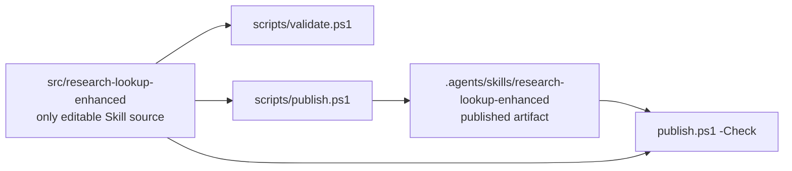
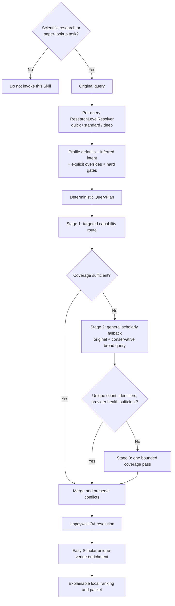
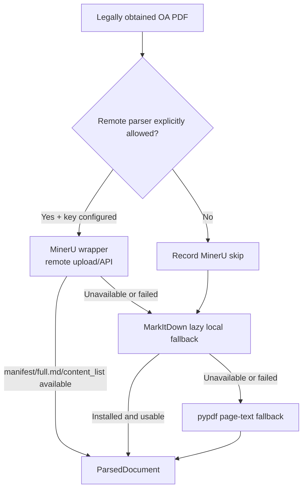

# Architecture

## Repository boundary

`src/research-lookup-enhanced/` is the only editable Skill package. The workspace
Skill directory is a generated publication artifact. Project documentation,
environment examples, smoke checks, and release scripts live outside the package.

## Retrieval flow

The local query builder is deterministic and preserves the user's original query.
It creates a capped set of variants, records filters and intent, recommends a
capability route, and supplies a global/provider request budget. It does not depend
on an LLM or a translation service. A hosting Agent or other caller may provide one
explicit English scholarly query for a low-confidence Chinese or mixed-language
query; the planner validates and audits that input without replacing the original.
The selected English variant is also used for textual relevance ranking so English
retrieval is not scored against Chinese character tokens.

OpenAlex is the cross-disciplinary primary discovery source when its API key is
configured. Crossref is an independent bibliographic companion and DOI verifier.
Europe PMC is preferred for biomedical discovery and JATS. Semantic Scholar is
optional, key-gated, serialized in-process, and paced at no less than 1.2 seconds
between requests. Unpaywall and Easy Scholar never participate in discovery.

Every route attempt records the query variant, selection or skip reason, budget
snapshot, result count, error/degradation, and fallback stage. Records also retain
route provenance through merging and ranking.

The resolver is a depth policy for an already-valid scholarly task, not a general
request classifier. Omitting a level preserves the historical `standard` behavior;
`auto` is explicit opt-in for deterministic local rules. Every batch query receives
its own immutable effective run configuration, while Provider clients and caches may
remain shared. Profile values never authorize MinerU upload or model downloads.

Citation and recommendation expansion still require explicit seeds. They consume
the same routed request budget left after discovery; no Profile reserves or creates
an independent graph budget.

## PDF parser chain

HTML and JATS stay on the local extraction path. Only a PDF location explicitly
marked open access can enter the PDF chain.

`ParsedDocument` carries text/Markdown, sections, tables, captions, references,
source hash, parser name/version, local output paths, warnings/errors, and parser
provenance. MarkItDown is treated as a lightweight LLM-oriented conversion, while
`pypdf` is explicitly marked low-structure-fidelity.

A `deep` level raises the candidate limit only after full-text extraction has been
explicitly requested. It does not enable extraction or remote upload by itself.

## Optional Sciverse boundary

The source package defines an `EvidenceProvider`/evidence-record handoff protocol.
It preserves stable identifiers, direct evidence versus inference, offsets, and
partial/truncated warnings. No Sciverse files are imported and no Sciverse runtime
is required by the core pipeline.
