# End-to-End Workflow

## Purpose

This workflow converts a broad domain into a research map and a portfolio of falsifiable opportunities. It is designed for direction selection under uncertainty, not for proving absolute novelty or replacing a systematic review, patent search, or freedom-to-operate opinion.

```mermaid
flowchart LR
    A["Decision and capability passport"] --> B["Breadth ledger"]
    B --> C["Mapping lattice"]
    C --> D["Landscape and evidence retrieval"]
    D --> E["Causal-interface candidates"]
    E --> F["Close-match and red-team audit"]
    F -->|"revise or reject"| C
    F -->|"survives"| G["Shared-platform risk portfolio"]
    G --> H["Three-month experiments and one-year platform"]
    H --> I["Decision log and next search"]
    I --> J["Synthesize primary human-facing map report"]
    J --> K["Validate and deliver"]
```

## Phase 0: Define the Decision

Record five classes of information before searching:

| Class | Required questions |
|---|---|
| Decision | What decision must this map support: thesis topic, grant theme, platform investment, collaboration, or experiment? |
| Horizon | What must be true in three months, one year, and three to five years? |
| Capability | What can the laboratory fabricate, measure, model, package, and integrate now? |
| Constraint | What dimensions are fixed: budget, feature size, temperature, materials access, cleanroom modules, ethics, or data? |
| Guarantee | What constitutes a useful output: ranked candidates, a decisive experiment, a platform plan, or a stop decision? |

Tag every input as `Observed`, `Reported`, `Assumed`, or `Unknown`. Unknowns become explicit information-gathering tasks.

## Phase 1: Build a Capability Passport

Do not summarize the lab as "has microfabrication." Record transferable modules:

- Substrate and material preparation.
- Lithography resolution and overlay.
- Deposition, etch, anneal, passivation, transfer, and encapsulation.
- Electrical, optical, thermal, magnetic, mechanical, and time-resolved measurements.
- Device modeling, compact modeling, circuit simulation, multiphysics, and data analysis.
- Packaging, interconnect, arrays, peripheral circuits, and system demonstration.
- External dependencies and lead times.

For each module, record `ready`, `adaptable`, `requires collaborator`, or `unavailable`. This prevents recommendations that are scientifically attractive but operationally unreachable.

## Phase 2: Describe the Field Without Materials

Use three orthogonal views.

### Workload view

Examples include inference, training, continual adaptation, event processing, sensing, control, communication, and scientific computing.

### State view

Ask what information must exist physically and for how long:

- Static parameter state.
- Dynamic context or working-memory state.
- Sensory state.
- Adaptive or metaplastic state.
- Probabilistic state.
- Structural or connectivity state.

The state taxonomy is domain-specific. Its purpose is to expose the operation a physical primitive must perform.

### Budget view

Track the constrained quantity: joules per useful decision, bytes moved, bandwidth, latency, area, retention, update energy, precision, noise tolerance, calibration effort, endurance, temperature, or data-label burden.

## Breadth Gate

Before ranking any candidate, the ledger should contain at least:

- Four distinct bottleneck families.
- Four distinct mechanism families.
- Two application contexts.
- One mechanism outside the laboratory's current favorite material family.
- One counterexample or disconfirming search for each top branch.

These are defaults, not magical numbers. If the field is genuinely narrower, explain the exception. The gate exists because the first plausible intersection often becomes an anchor.

An anchor warning is triggered when any of the following occurs:

- More than half the map inherits one paper's terminology.
- The map begins with a named material or device rather than a persistent need.
- The proposed novelty disappears when the application label is removed.
- All candidates share the same untested physical assumption.
- Search terms repeatedly restate the favored idea instead of seeking alternatives.

When triggered, freeze ranking, add neighboring bottlenecks and mechanisms, and run explicit disconfirmation searches.

## Phase 3: Build the Mapping Lattice

Create one row per plausible chain:

| Workload | State type | Persistent bottleneck | Missing primitive | Required state operation | Device mechanism | Material/process family | System metric | Evidence IDs |
|---|---|---|---|---|---|---|---|---|

Distinguish these layers:

- `Architecture`: organization of compute, memory, sensing, and communication.
- `Primitive`: operation the architecture lacks or performs expensively.
- `Mechanism`: physical state variable, its governing dynamics, write control, readout, and failure modes.
- `Material/process`: implementation route for that mechanism.

The same mechanism may serve several architectures. The same material may host several mechanisms. Do not collapse these relationships.

## Phase 4: Search in Two Passes

### Pass A: Landscape discovery

Search each bottleneck and mechanism family independently. Identify terminology, canonical baselines, recent representative works, negative results, reviews, and benchmark conventions.

### Pass B: Opportunity testing

For every promising intersection, search:

1. Exact phrase and synonyms.
2. Mechanism plus target operation.
3. Material plus target operation.
4. Architecture plus device family.
5. Direct-neighbor authors and citations.
6. Counterexamples and failure modes.
7. Patents and major conferences when translation or priority matters.

Preserve the query, date, source, filters, result count when available, selected records, and reason for selection or rejection.

## Phase 5: Extract Claims, Not Just Papers

Each source should support one or more atomic claims. A source record must state:

- Core contribution.
- Exact claim supported or contradicted.
- Directness of support.
- Experimental or analytical boundary.
- Limitation and unresolved question.
- Stable citation and retrievable provenance.

Do not cite a review for a specific experimental value when the primary paper is available. Do not use an abstract to support a claim that depends on methods, figures, or supplementary data.

## Phase 6: Identify Unresolved Causal Interfaces

A candidate is strongest when the scientific unknown lies at an interface between layers. Common interfaces include:

- Device dynamics and algorithmic state equations.
- Sensing physics and learned information compression.
- Local adaptation rules and system stability.
- Stochastic device statistics and calibrated uncertainty.
- Heterogeneous integration and communication energy.
- Material kinetics and circuit-level refresh or calibration.

Candidate question template:

`Can control X independently modulate physical state operation Y under constraints Z, producing measurable advantage A over strongest baseline B?`

The question must allow a negative answer.

## Phase 7: Close-Match and Crowding Analysis

For each candidate, build a neighborhood table:

| Neighbor | What overlaps | What differs | Same causal interface? | Evidence | Implication |
|---|---|---|---|---|---|

Classify the position:

- `Crowded`: many direct demonstrations address the same interface and benchmark.
- `Active but open`: close neighbors exist, but a causal or integration gap remains.
- `Sparse evidence`: few direct matches; uncertainty is high, not necessarily opportunity.
- `Unsearched`: coverage is insufficient to classify.

Never label a route "empty" or "nobody is doing it." Negative search evidence is bounded by databases, terminology, dates, languages, indexing, and access.

## Phase 8: Design a Risk Portfolio

Score candidates on a 1-5 ordinal scale with a written rationale:

- Bottleneck persistence.
- Mechanism depth and falsifiability.
- Laboratory capability transfer.
- Three-month first-data feasibility.
- One-year platform leverage.
- Evidence for an open causal interface.
- External dependency burden.
- System-level value if successful.

Weights may be stated, but always show sensitivity: would the ranking change if novelty confidence or fabrication readiness were one grade lower?

Select:

- `Low risk`: known process path, meaningful mechanism question, fast decisive data.
- `Medium risk`: new coupling or control dimension, moderate integration burden, platform value.
- `High risk`: potentially defining concept, strong causal question, substantial uncertainty or dependency.

The three routes should share infrastructure. Otherwise they are three unrelated projects rather than a research program.

## Phase 9: Red-Team Before Recommendation

Apply the checks in `critical-thinking.md`. At minimum, test:

- Strongest conventional and digital baseline.
- Alternative physical explanations.
- Peripheral, calibration, refresh, and data-conversion overhead.
- Device variability, drift, endurance, and scaling.
- Benchmark leakage and task cherry-picking.
- Whether novelty is only a recombination of familiar modules.
- Whether the three-month experiment can discriminate mechanisms.

Revise or reject candidates when a decisive weakness is found. Record the decision rather than deleting the failed route.

## Phase 10: Synthesize the Reader Report

Read `reader-report.md`. Synthesize the dynamic `map_report_<short_task_name>_<YYYY-MM-DD>.md` from the completed working artifacts. Treat this as the primary user-visible result, not an appendix.

The working artifacts retain claim IDs and detailed provenance. The reader report uses numbered citations, DOI or stable links, and GitHub callouts. It must explain the causal progression and comparative decision without requiring the reader to open the evidence matrix.

End with:

- The current recommendation and confidence.
- What evidence would reverse the recommendation.
- Immediate experiments and searches.
- Dependencies requiring collaborators or procurement.
- The next decision date.

In each important citation callout, state the source's core contribution, the exact viewpoint it supports, and its boundary. Keep database document/chunk/offset identifiers out of the reader report.

## Phase 11: Validate and Deliver

Run `scripts/validate_run.py --strict`. Resolve errors and explain any warnings that remain.

Deliver the reader report first. Mention the numbered working artifacts as the audit trail rather than presenting them as equivalent user-facing outputs.
