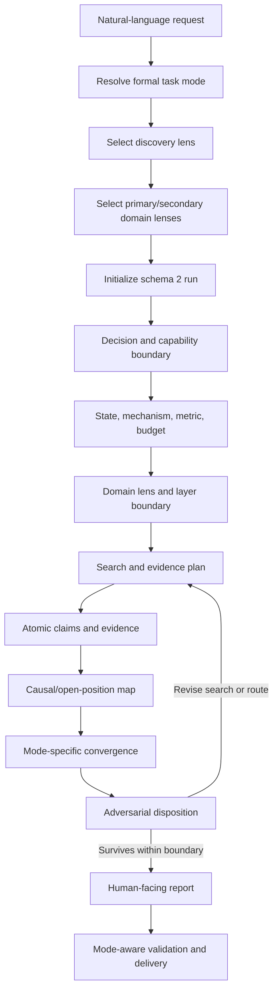

# End-to-End Workflow

Use this workflow to turn a scientific or engineering decision into an auditable
run. Route the request before research, persist the mode, discovery lens, and
domain lenses, preserve a shared evidentiary spine, and then apply the selected
branches.

## Contents

- [Read the contracts](#read-the-contracts)
- [Workflow overview](#workflow-overview)
- [Phase 0: Route mode and select lenses](#phase-0-route-mode-and-select-lenses)
- [Phase 1: Define the decision and capability boundary](#phase-1-define-the-decision-and-capability-boundary)
- [Phase 2: Define state, mechanism, metric, and budget](#phase-2-define-state-mechanism-metric-and-budget)
- [Phase 3: Apply domain lenses and layer boundary](#phase-3-apply-domain-lenses-and-layer-boundary)
- [Phase 4: Design the search and evidence plan](#phase-4-design-the-search-and-evidence-plan)
- [Phase 5: Retrieve evidence and register claims](#phase-5-retrieve-evidence-and-register-claims)
- [Phase 6: Build the causal and open-position map](#phase-6-build-the-causal-and-open-position-map)
- [Phase 7: Test alternatives, baselines, and hidden costs](#phase-7-test-alternatives-baselines-and-hidden-costs)
- [Phase 8: Apply the mode branch](#phase-8-apply-the-mode-branch)
- [Phase 9: Run adversarial audit and disposition](#phase-9-run-adversarial-audit-and-disposition)
- [Phase 10: Synthesize the reader report](#phase-10-synthesize-the-reader-report)
- [Phase 11: Validate and deliver](#phase-11-validate-and-deliver)
- [Parent-child transitions](#parent-child-transitions)
- [Stop rules and completion](#stop-rules-and-completion)

## Read the contracts

Before executing a persisted run, read:

- [run-modes.md](run-modes.md) for routing, mode gates, lens behavior, and parent-child rules;
- [schemas.md](schemas.md) for the authoritative manifest and artifact profiles;
- [evidence-confidence.md](evidence-confidence.md) for claim-level confidence and hard caps;
- [domain-lenses.md](domain-lenses.md) for domain-specific state chains and evidence ceilings.

Load [search-strategy.md](search-strategy.md), [critical-thinking.md](critical-thinking.md), and [reader-report.md](reader-report.md) when entering their corresponding phases. Do not duplicate or improvise schema fields in this workflow; use [schemas.md](schemas.md).

## Workflow overview

All four modes share the same invariant intersection:

`durable bottleneck x falsifiable causal/physical mechanism x transferable capability x bounded open position`

The amount of breadth, the convergence product, and the completion gate change by mode. Evidence, Inference, and Recommendation remain separate in every mode.

## Phase 0: Route mode and select lenses

### Resolve a formal mode

Interpret the request using [run-modes.md](run-modes.md):

- broad comparison or portfolio selection -> `landscape`;
- one selected branch or causal interface -> `focus`;
- claims, papers, or a missing evidence chain -> `evidence-audit`;
- an existing persisted run or report -> `run-audit`.

If the user requests `auto`, resolve it **before initialization**. Persist the selected formal mode and the routing rationale. Never persist `auto` as the run mode and never disguise a routing ambiguity as certainty.

### Select one discovery lens

- `frontier-led`: orient with recent authoritative synthesis and representative primary evidence, then add limitations and direct neighbors.
- `gray-space-led`: build candidates from a two-sided mismatch and a bounded neighbor gap; zero hits never prove novelty.
- `balanced`: combine independent frontier radar and mismatch ledger; use this by default when the user does not choose.

The lens does not determine the mode. A focused route may be frontier-led or gray-space-led; a broad landscape may use either.

### Select and persist domain lenses

Choose one primary domain lens independently of mode and discovery lens. Use a
specialized key when it fits, `generic-physical-engineering` as the portable
fallback, or `custom` only with all ten Common Lens Interface fields recorded
in `domain_lens_notes`. Add secondary lenses only for real interfaces. Persist
the primary key, duplicate-free secondary list, and notes in the manifest.

### Confirm persistence boundary

Before creating files, record the output location, language, evidence cutoff,
requested mode, selected mode, discovery lens, primary/secondary domain lenses,
and any parent run. Initialize the artifact profile defined by
[schemas.md](schemas.md). Do not begin research in an unpersisted scratch
structure when the user requested a persisted run.

For each valid manifest `context_sources[]` record, carry its unique `CTX-###`
`source_id` into the external ID closure. It may satisfy visible ID references
without a local definition, but it does not become scientific evidence.

## Phase 1: Define the decision and capability boundary

Record five classes of information before searching:

| Class | Required question |
|---|---|
| Decision | What concrete choice must this run change? |
| Horizon | What must be learned or decided at the first-data and platform horizons? |
| Capability | What can be fabricated, measured, modeled, integrated, or accessed now? |
| Constraint | Which budgets, materials, feature sizes, tools, collaborators, or deadlines are fixed? |
| Guarantee | What result would count as useful: a map, one executable route, a confidence ruling, or an audit disposition? |

Tag each capability fact as `Observed`, `Reported`, `Assumed`, or `Unknown`. Give
every capability a meaningful `Source or evidence` basis. `Observed` and
`Reported` may not use an uncertain-only basis such as not yet verified,
unverified, unknown, assumed, learning only, planned only, or not documented.
`Reported` may be unreplicated if it names the underlying report, record, or
source. For every `Assumed` or `Unknown` item that controls route feasibility,
add a verification action or an explicit readiness penalty.

Record transferable modules rather than broad labels such as “has microfabrication”:

- material preparation and process modules;
- electrical, optical, thermal, magnetic, mechanical, wave, or time-resolved measurements;
- multiphysics, device, compact, circuit, architecture, and data-analysis modeling;
- packaging, arrays, peripheral circuits, software/hardware-in-loop, and external dependencies.

A capability passport affects feasibility and sequencing. It does not supply scientific evidence for the mechanism.

## Phase 2: Define state, mechanism, metric, and budget

Describe the field or branch without starting from a favorite implementation.

### State or workload

Ask what physical or informational state must exist, how it is written, how long it persists, how it is read, and what operation it must perform. Examples include static state, dynamic context, adaptive state, probabilistic state, structural state, wave state, or connectivity state.

### Persistent bottleneck

State:

- the affected operation;
- the metric and operating regime;
- why the limitation is consequential;
- evidence that it persists rather than reflecting one implementation or obsolete benchmark;
- plausible bypasses that would make it nonpersistent.

### Mechanism and observables

Express the causal question as:

`Can control X independently modulate state operation Y under constraints Z, producing observable A relative to baseline B?`

Define a null result and the strongest alternative explanation before seeking confirming examples.

### Budget

Use the budget appropriate to the layer: energy, latency, area, bandwidth, precision, stability, retention, endurance, loss, efficiency, calibration, yield, fabrication complexity, data movement, label burden, or other constrained quantity.

## Phase 3: Apply domain lenses and layer boundary

Load the manifest-declared primary domain lens from
[domain-lenses.md](domain-lenses.md) and secondary lenses only where the claim
crosses the recorded interface. Do not silently substitute a different lens
during search or synthesis.

For each claimed chain:

1. Mark the last directly evidenced layer.
2. Mark each later bridge as validated, modeled, assumed, or missing.
3. State which layer is intentionally outside the run.
4. Prevent lower-layer proxy evidence from inheriting a higher-layer conclusion.

Examples of bridges that require explicit validation include material state -> device readout, device -> compact model, cell -> array, array -> workload, material tuning -> finite metasurface, and biological observation -> computational advantage.

## Phase 4: Design the search and evidence plan

Follow [search-strategy.md](search-strategy.md) and adapt search coverage to both mode and lens.

### Common evidence lanes

Plan for:

1. canonical definitions and baselines;
2. recent frontier radar;
3. representative primary evidence;
4. direct neighbors and crowding;
5. strongest baseline and alternative mechanism;
6. negative, mixed, or limiting evidence;
7. translation evidence where the claim crosses layers.

### Mode-scaled coverage

- `landscape`: cover independent bottleneck and mechanism families before ranking.
- `focus`: cover the local alternative set around the selected interface, not the entire field.
- `evidence-audit`: search by atomic claim and required evidence role until each critical claim has a disposition.
- `run-audit`: start from parent claims and references, then search only where integrity, contradiction, or decision impact requires it.

### Lens-scaled entry

- `frontier-led`: begin with recent authoritative syntheses and representative primary work; recover canonical and negative evidence.
- `gray-space-led`: search both sides of the mismatch independently, then exact and adjacent interfaces.
- `balanced`: maintain separate frontier and mismatch ledgers before merging conclusions.

Log query, date, corpus, filters, result count when available, selected records, rejected records, misses, and next query. A search miss is bounded negative evidence, never global absence.

After searching, complete coverage-audit with exactly one row for each stable
lane. Each row binds the lane to its actual queries and responsive evidence,
states covered, thin, query-failed, or out-of-scope, and records the remaining
blind spot plus next-query or stop rationale. A lane with only a zero-result
query is not covered. Unknown counts are not positive counts. Relevant Evidence
IDs must be selected by the cited same-lane Query IDs; a plausible paper from a
different query does not close that lane.

## Phase 5: Retrieve evidence and register claims

Extract atomic claims rather than accumulating paper summaries. Use [evidence-confidence.md](evidence-confidence.md) for claim types, evidence roles, verification depth, confidence, hard caps, and allowed wording.

For each decision-critical source:

- preserve DOI or stable link and a retrievable location;
- state its actual contribution;
- identify the exact bounded claim it supports, limits, or contradicts;
- record method and regime applicability;
- identify group, sample, dataset, or model dependence;
- retain negative and conflicting evidence;
- expand beyond metadata or abstract when the decision depends on methods, figures, tables, or supplementary context.

For every evidence row, make the claim edge machine explicit. `Claim IDs`
must contain defined atomic claims, and one exact `Stance` must apply to every
listed claim: `supports`, `limits`, `contradicts`, `mixed`, or
`context`. Split a source into separate evidence rows when it supports one
claim but limits another. Supporting and limiting confidence lists must point
back to rows that name the same claim with a compatible stance; context-only
records cannot satisfy either list.

For schema-2 modes other than `run-audit`, close citations in both directions:
every non-sentinel evidence `Reader ref` resolves to one numbered reader
reference, every reader reference resolves back to one evidence row, and their
normalized DOI/stable links match. Keep a run-audit report's own references
separate from its recomputed parent citation projection.

If resolving a decision-critical source requires a full Deep Reading run, place
it in deep-reading-handoff. State the paper key, affected claim or route,
decision-changing question, priority, and status. On import, retain the Deep
Reading run path and canonical record references. Only paper-package.md,
reading-report.md, auxiliary-literature-table.md,
external-evidence-matrix.md, and view-report-audit.md are canonical inputs;
view-report.md is derived and cannot be imported as evidence. Set
verification_depth=canonical-deep-read on imported evidence and do not copy a
second parallel ledger. Resolve the actual canonical run and validate its local
structure with Deep Reading's `check_canonical.py`. Every imported row needs an
existing typed record locator owned by that run, and its DOI/stable identity
must match that canonical main or auxiliary source. An auxiliary paper is not
required to match the main-paper DOI. Each canonical-depth row has exactly one
imported handoff owner; queued/blocked/skipped requests import no rows. Merge
duplicate paper reports and shared-source evidence without losing claim edges.

Keep `frontier_salience` separate from `claim_confidence`. Recency, venue, citations, or roadmap attention may prioritize retrieval but cannot upgrade the scientific claim.

## Phase 6: Build the causal and open-position map

Construct the layer chain appropriate to the selected domain lens. Preserve architecture, primitive, mechanism, state variable, implementation route, and observable as distinct nodes.

For each candidate interface, record:

- durable bottleneck and bounded regime;
- causal control, state operation, readout, and competing mechanisms;
- direct evidence and evidence ceiling;
- nearest neighbors and what they already close;
- exact unresolved interface;
- transferable capability and missing dependencies;
- decisive test and possible outcomes.

Classify the position as `crowded`, `active but open`, `sparse evidence`, or `unsearched`. “Sparse” and “unsearched” are uncertainty labels, not opportunity grades.

## Phase 7: Test alternatives, baselines, and hidden costs

Apply [critical-thinking.md](critical-thinking.md) at the layer where value is claimed.

At minimum, test:

- strongest physical, conventional, digital, or non-biomimetic baseline;
- alternative causal mechanisms and measurement artifacts;
- sample, device, seed, batch, and laboratory dependence;
- variability, drift, reliability, and operating-window boundaries;
- peripheral, calibration, refresh, data-conversion, control, fabrication, and measurement costs;
- proxy-to-system layer jumps and unmatched budgets;
- whether the decisive experiment distinguishes positive, negative, and ambiguous outcomes.

Do not save the strongest counterargument for a decorative risk section. Let it alter the search plan and candidate definition before convergence.

For mixed or conflicting results, record the condition delta before deciding
whether support dominates, a limitation dominates, the evidence splits by
condition, or the tension remains unresolved. Do not collapse conditionally
different results into an average verdict. Label each tension `direct-conflict`,
`evidence-gap`, or `condition-difference`, bind both sides to actual source/claim
edges and state an actionable resolution. Only an unresolved direct contradiction
activates the unresolved-direct-conflict cap; a missing comparison or a limited
claim does not. An independent reviewer judges the scientific classification.

## Phase 8: Apply the mode branch

### `landscape`

1. Apply the global breadth gate defined in [run-modes.md](run-modes.md).
2. Build the full mapping lattice before ranking.
3. Compare genuinely different causal interfaces.
4. Select zero, one, or several substantive routes within the user's scope;
   risk is descriptive, not a quota. Information, mechanism, and system validation
   are dependent work packages unless they have independent questions, knowledge
   outputs, and stop conditions. Reuse infrastructure where routes genuinely share it.
5. Give each finalist owned execution fields, positive/negative/ambiguous
   interpretations, a kill criterion, platform path, and retained value after
   failure; project every route into owned reader execution and outcome rows.
6. Project the exact `C-### -> low|medium|high` mapping from `candidate-routes`
   into reader `decision-summary`, one row per candidate.

7. Apply openness, contribution, and feasibility as separate gates. Compute
   Overall by the schema rule and carry a bounded recall caveat for every route.
8. If there are eligible routes, give at most three go or conditional-go routes a fast pilot:
   two distinct hypotheses, discriminating test and observable, at most fourteen
   days, a resource cap, and separate advance and kill/revise thresholds.

When no candidate survives, leave route-owned collections empty, write
`Selection outcome: no-candidate`, and propagate rejection and red-team decisions
through existing decision-critical atomic claims. If candidates exist but none
is gate-eligible, leave fast pilots empty. For each deferred route, next-actions
must name the input/dependency, deliverable, and openness/contribution/feasibility
gate that the result changes. This is not authorization for contact, purchases,
or experiments. Fourteen days limits only fast pilots: retain conditional
three-month tests and one-year platform paths, including failure assets.

Only landscape requires the scope-appropriate global breadth gate by default.

### `focus`

1. Freeze the selected branch and its parent boundary when present.
2. Build a local alternative map containing the proposed mechanism, strongest alternative mechanism, and strongest practical route.
3. Retain zero, one, or several substantive candidates, with one primary when
   nonempty. Keep comparators and fallback designs without requiring separate C-IDs.
4. Give each actual candidate an owned staged-execution row
   and separate positive/negative/ambiguous working rows, then project the same
   route IDs and exact `C-### -> primary|comparator|fallback` mapping from
   `focus-routes` into reader `recommended-routes`, one row per route.
5. Explain question sufficiency, necessity, timeliness, and why this route is preferable within capability constraints.

6. Apply the same three opportunity gates to each actual candidate, then define
   at most three fast pilots for eligible routes. With no candidates, leave
   route-owned tables empty and close atomic-claim decisions plus a concrete
   information check or bounded stop, using Selection outcome: no-candidate.

Do not force a focus run to invent low-, medium-, and high-risk routes or repeat a landscape-wide breadth exercise.

### `evidence-audit`

1. Freeze the audit scope and atomic claim register.
2. Define the evidence roles required by every decision-critical claim.
3. Search support, limitations, contradictions, replication, direct neighbors,
   and baselines; enforce exact Claim-ID linkage and compatible stance for every
   confidence edge.
4. Assign claim-level confidence under all hard caps.
5. State allowed wording, confidence-changing evidence, and an explicit disposition.
6. Keep at most one `claim-confidence` row per claim and exactly one per
   decision-critical claim. Make `target-claims`, `claim-register`, canonical
   `claim-confidence`, `confidence-assessment`, `allowed-wording`, and reader
   `claim-verdicts` exact-once projections of the same target set. Give every
   target at least one gap row; extra gap rows may repeat it, but none may name
   an undeclared claim.

When linked to a parent, write a supplement. Do not silently mutate the parent recommendation.

### `run-audit`

1. Treat the existing run as an immutable audit object.
2. Run `python scripts/parent_audit.py "<parent-run>"`. Copy its complete deterministic artifact, manifest, ID, and parent-citation projections into the child audit; do not substitute the child report's own bibliography. Schema 1.0 uses the no-reader sentinel; schema 1.1 infers exactly one safe matching report from `artifact_files` without requiring `primary_artifact`; schema 1.2 uses `primary_artifact`; and schema 2 uses `artifact_roles.reader_report`.
3. Check lineage identity, snapshot stability, claim confidence, report consistency, and completion gates. For schema 2, count definitions only in the registered marker, exact ID column, and manifest-declared authoritative artifact role; a wrong-role ID occurrence is not a definition. A flawed or incomplete parent may be audited if the child reports the defect exactly.
4. Attack bottleneck persistence, causality, open-position language, capability inflation, cross-scale inference, baseline fairness, and hidden costs.
5. Assign `Keep`, `Downgrade`, `Revise`, or `Kill` to every decision-critical finding.
6. Set every manifest repair to `canonical_manifest_repair(Check, Result)`; `pass` and `not-applicable` rows use `retain observed state`. Give every manifest row one valid `D-###` that resolves to exactly one decision, with `pass` and `not-applicable` bound to `Keep`. Give each failed check high/blocking severity and a non-attack, non-`Keep` Decision ID used by no other manifest row. Its Target and Affected IDs are the same single main route/claim, Decision is `Parent manifest failure [<check>]`, Trigger Attack IDs is `not-applicable: deterministic manifest check`, and Owner/next action is the canonical repair.
7. Project all and only failed checks once into reader integrity as `parent manifest failure [<check>]`; use the clean Keep sentinel only with zero failures. Merge integrity and attack decisions into the strongest final route verdict, with integrity binding an equal-rank tie.
8. Bind every recomputed ID/citation anomaly to a substantive repair and a
   non-`Keep` authoritative decision. Use the stable dedicated anomaly source,
   deterministic trigger, and Owner=Repair unless it jointly shares a non-`Keep`
   attack decision. Include anomalies in strongest aggregation and keep
   working/reader final finding, repair, verdict, and D-ID aligned.

A list of concerns without decision impact does not satisfy run audit. Parent snapshot drift or a machine-projection mismatch invalidates the audit rather than becoming a negotiable scientific verdict.

## Phase 9: Run adversarial audit and disposition

Use a red team that can change the decision. Require it to answer:

- Is the scientific question real, necessary, timely, and nontrivial?
- Is the claimed bottleneck persistent, or manufactured by an outdated metric or boundary?
- Can the experiment distinguish the favored mechanism from credible alternatives?
- Is the open position robust to synonym, adjacent-module, conference, patent, and close-author searches where relevant?
- Is capability status inflated?
- Is a material/device proxy being promoted to array, IC, architecture, or workload value?
- Are baseline budgets and system overhead matched?
- What positive, negative, or ambiguous result would change the route?

Create at least one structured row for each exact surface:
`problem-adequacy`, `mechanism`, `evidence`, `open-position`,
`capability`, `cross-scale`, `baseline-system-cost`, and
`bio-inspired-translation`. If biology is genuinely irrelevant, retain a
bounded N/A attack with its reason and ordinary-baseline boundary. If biology is
invoked, separately record the de-biologized question, mathematical operator or
state update, algorithm, hardware primitive, same-budget baseline,
principle-specific ablation, and measurable gain boundary; the chain cannot be
wholly N/A.

Record the evidence, reasoning, action, owner, and reversal condition. Copy
every attack to the reader impact table. Every non-`Keep` attack must alter
the affected main route/claim decision, confidence/wording, or explicit parent
impact; for one target, propagate the strongest binding verdict
(`Kill > Revise > Downgrade > Keep`). Preserve rejected routes and superseded
decisions rather than deleting them.
For `run-audit`, this maximum includes manifest-failure and recomputed parent
ID/citation-anomaly decisions as
well as attacks. An integrity decision at the maximum rank takes Decision-ID
binding precedence over an equally strong attack.

## Phase 10: Synthesize the reader report

Read [reader-report.md](reader-report.md) and synthesize the mode-appropriate human-facing report from stable working artifacts.

Every report must answer, in the user's language and in a form appropriate to
its mode:

1. **What** decision, route, claim, or immutable run snapshot is being judged?
2. **Why** does it matter now, and which decision would change?
3. **Need to know**: which states, mechanisms, metrics, evidence criteria,
   boundaries, or integrity facts are required to judge it?
4. **How** will the route be tested, the claim adjudicated, or the run audited
   and repaired?
5. **What we learn**: which bounded conclusion and next decision follow?

For `landscape` and `focus`, additionally answer:

1. Why is the problem sufficient, necessary, timely, and urgent within the
   stated boundary, including the strongest counterargument to each favorable
   judgment?
2. Which SOTA approach families matter and why do they leave the persistent
   bottleneck unresolved?
3. What is each recommended route in plain language: existing basis -> new
   control/method -> measurement -> interpretable conclusion?
4. Why each route rather than its strongest alternative?
5. For each route, what happens under positive, negative, and ambiguous outcomes,
   and what evidence would downgrade, revise, kill, or reverse it?

For `evidence-audit`, instead answer:

1. Which atomic claims are decision-critical and why?
2. Which evidence roles, confidence caps, and applicability boundaries are
   required?
3. How were support, limitations, contradictions, independence, and direct
   neighbors adjudicated?
4. What wording is now allowed, and should the parent be kept, downgraded,
   revised, or killed?
5. Which cheapest action would upgrade or overturn the conclusion?

For `run-audit`, instead answer:

1. Which immutable parent snapshot and decision surface were audited?
2. Which integrity or scientific defects were independently reproduced?
3. Why does each material defect change the parent decision?
4. What exact artifact, claim, wording, control, or evidence repair is required?
5. What remains uncertain after Keep, Downgrade, Revise, or Kill dispositions?

Do not require an audit report to invent SOTA families, a route portfolio, or
experimental outcome branches unless the audit itself makes or revises those
field-level claims.

Convert internal evidence IDs into ordinary numbered citations with DOI or stable links. Keep database internals in the evidence matrix. Explain each decision-critical source's contribution, supported viewpoint, and boundary.

## Phase 11: Validate and deliver

Run the strict validator against the persisted run. Resolve errors and explain
any remaining warnings. Confirm route ownership, Claim-ID/stance compatibility,
role-bound ID authority, all eight attack surfaces, target-level non-`Keep`
propagation, the bio trigger/N-A rule, canonical manifest repairs, high/blocking
failure severity, one-to-one failure decisions disjoint from attack decisions,
exact reader integrity projection, and the combined strongest run-audit route
disposition. Validation checks structural and cross-artifact integrity; it does
not certify scientific truth.

Deliver the human-facing report first. Present working artifacts as the audit trail. State:

- selected mode, discovery lens, and primary/secondary domain lenses;
- current recommendation or disposition;
- confidence and active hard caps;
- decisive next action;
- unresolved dependency or missing evidence;
- next decision point.

## Parent-child transitions

Create a new child run rather than changing a run's meaning in place:

- landscape branch selected -> child `focus`;
- weak decision-critical claims -> child `evidence-audit`;
- persisted result challenged -> child `run-audit`;
- evidence audit closes a bounded interface -> new or resumed `focus`;
- run audit finds premature convergence -> new landscape or explicit landscape revision.

Keep parents read-only. Use the lineage and inheritance mechanisms defined in [schemas.md](schemas.md); preserve inherited, reverified, revised, and rejected facts distinctly.

## Stop rules and completion

Stop expanding search when:

- every decision-critical claim has responsive support and limitation evidence or an explicit `Insufficient` disposition;
- the strongest baseline and alternative mechanism are represented;
- new searches repeat the same evidence chains without changing confidence or the decision;
- unresolved gaps have exact next searches or decisive experiments.

Complete the run only when the selected mode's gates in [run-modes.md](run-modes.md), the artifact contract in [schemas.md](schemas.md), the confidence contract in [evidence-confidence.md](evidence-confidence.md), and the reader-report contract all pass. Never use a landscape gate to declare focus or audit work incomplete, and never use a narrow audit to claim landscape coverage.
